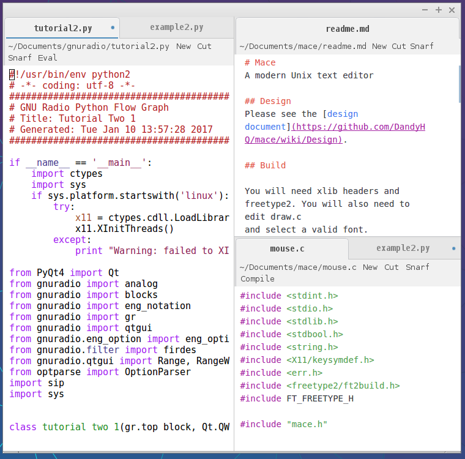

# Mace Design Docs
Mace is a new Unix oriented text editor in development. This repository contains a number of images showcasing what it may look like as well as some documents explaining the visual features.

This is the most complex of the Mace design images. But there's still more features not showcased in it. Feel free to browse the other images to get a better idea of what Mace can do

## Features

* New files are opened as tabs. Users can drag tabs around to tile them vertically or horizontally.
* Tabs sit inside tiles. Tiles can be vertical or horizontal but cannot sit inside tabs. Therefore changing through tabs still leaves the tiles in the same layout.
* Each tile has a focused tab. The tab that is the current focus in the editor is displayed in the users colour. It may be possible in the future to have multiple users in which case the other users colours are also applied to tabs.
* Unsaved files show a dot on the right side of the tab in the users colour.
* When the user hovors over a tab a cross will appear. If there is an "unsaved dot" already displayed in the tab, this will be replaced.
* In each window there is an "actions bar" which allows the user to quickly execute their favourite commands. This is user editable simply by clicking on it. The user has to right click on a command in order to execute it. If the user right clicks on a segment of the displayed path, mace will browse to that directory. If the path is altered and the user then executes save. The old path will be changed on the filesystem to reflect the new path. This can be used to rename files or folders.
* If a user Ctrl-Right clicks a command. The command will execute and put the result in a new tab. Certain commands such as Compile or Eval default to executing in a new tab.
* Commands are "smart", they are first passed to the filetype context (e.g. C, Python). If they are understand in this context they are executed. Otherwise they will be executed as a mace global command. In this manor the filetype context can shadow commands and extend their functionality. To explacitely call the global version. Prepend the command with "global" or "mace"

## TODO

* Fix some inconsistencies between the various images
* Add an image showing the folder view mode
* Clean up the lines between the tab bars of tiled windows
* Add scroll bars
